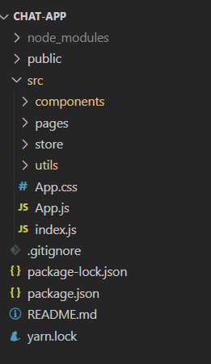

# 使用指南

## 0.准备工作

在运行仓库前，你需要安装 Node.js 并在 Node.js 中安装 yarn

`npm install -g yarn`

## 1.安装步骤

(1)下载本仓库到本地

(2)用 VSCode 打开根目录,在 Terminal 运行：

`yarn`

来安装所需的所有包

（3）安装完成后，在 Terminal 执行

`yarn start`

来启动项目

## 2.代码结构说明

  
React 使用组件化开发，网页所有的结构都用组件来构造  
App.js 是页面的主入口，定义了页面的主要结构

除导航栏和 footer 以外的主页在`src\page\Home\index.js`中实现  
Home 的主要区域在 MainSpace 中实现

`src\components`目录下放置了所有不便被归类的组件，其中包括了`MainSpace`文件夹  
MainSpace 中的代码可以根据注释理解

utils 文件夹存放了所有包装好的工具类  
包括了向 localstorage 中读写 api key 的`apikey.js`  
因此我们只需要在第一次使用的时候输入自己的 api key

`store`文件夹下存储了所有数据/状态操作，包括包装发送给 chatGPT 的请求

## 3.参考资料

React 入门到实战(2022 全网最新）  
https://www.bilibili.com/video/BV1Z44y1K7Fj  
对应文档教程  
https://www.yuque.com/fechaichai/qeamqf/xbai87#HmEWz  
Ant-Design 组件库  
https://ant.design/components/spin-cn
